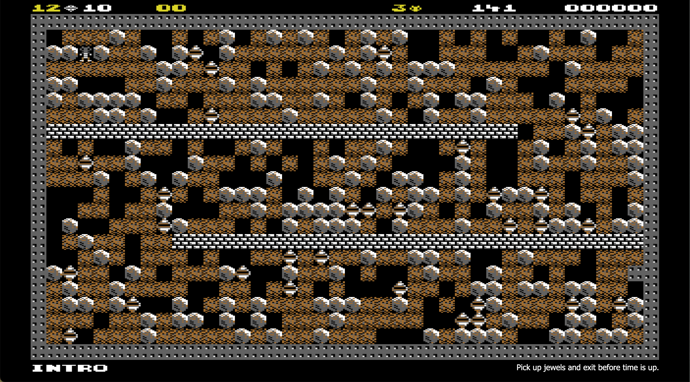

# Boulder Dash

Demo building a real-time 2D game using [Atomic](https://github.com/mlanza/atomic) and a simple ECS.  [Boulder Dash](https://boulder-dash.com/online-free-game/) is a classic from my childhood.

I've had a longtime fascination with [Entity Component Systems](https://en.wikipedia.org/wiki/Entity_component_system) and this felt a good opportunity to scratch that itch.  Although the concept originated as a means to facilitating performance, I wanted to model an ECS first as a simulation inside a functional core (i.e., stick to my usual approach).

As usual my early commits especially are experimental, figuring out how best to proceed.

Use the query string to modify how the app is loaded:
* `l`: the level number, 1 to 20, default is 1
* `d`: the difficulty rating, 1 to 5, default is 1
* `debug`: 1 or 0, default is 0 - displays visuals for components `falling`, `rolling`, `enchanted`
* `smooth`: 1 or 0, default is 0 - allows repositioned elements to glide into place
* `seed`: an integer seeding all randomizations (affects most maps)
* `norandom`: 1 or 0, default is 0 - determines whether or not random changes are applied to level

See [demo](https://doesideas.com/boulder-dash/?monitor=*).

## License
MIT

